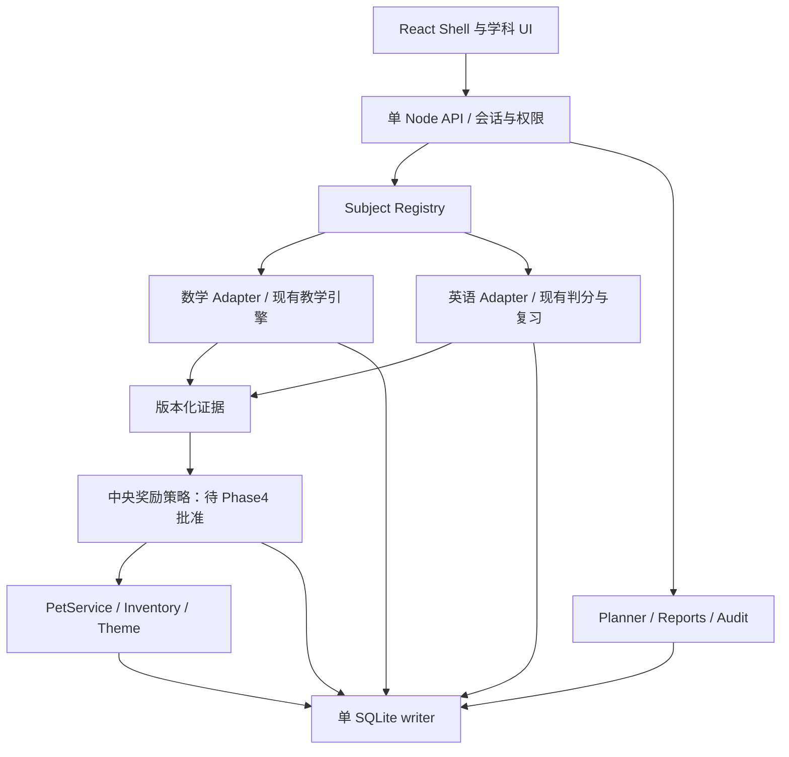

# 02 · 准确架构差异与整合边界

事实来自 01 文档的固定 SHA。标注“提案”的内容尚未实现。

## 三仓库对照

| 维度 | 数学 8e91154 | 英语 d0b42a8 | 新仓库当前 / 目标提案 |
| --- | --- | --- | --- |
| UI | React 19.2.8、TS、Vite 7；App 内 view 状态导航、课程工作台 | 静态 HTML/CSS，闭包 `assets/app.js`，Learn/Practice/My Words 等内部流程 | 当前仅 README；目标统一 React shell，URL 科目路由 |
| 引擎 | `server/store.mjs`、`pilot-store.mjs`、`thinking-store.mjs`、`shared/*models*` | app.js 同时包含词身份、判分、调度、持久化和 DOM UI | 提取 Adapter；不改现有教学结果，不改为统一选择题 |
| 持久化 | Node >=24 `node:sqlite`；单行 `progress.payload` JSON；WAL/FULL；单事务 mutate | schema V2 仍使用名字为 v1 的 localStorage keys；主记录、上一份备份、独立 device ID | 一份 SQLite；`subject_state` 保留完整科目状态，热点再规范化 |
| 竞争写入 | studio reading/session 有 revision；thinking eventId/signature 有去重及 409；非全局 revision | revision/writerId/storage event 防同 origin 标签页覆盖 | 所有写入按科目 revision CAS；跨设备 eventId/command receipt |
| 判分信任 | 数值/互动题服务器判分；说明/思维题有人审路径；部分旧 usedHint 是客户端声明 | 客户端发金币、XP和判分；首答/提示日志存在但属于导入的客户端证据 | 命令上传原始回答；服务器或授权家长追加判分事实 |
| 证据 | legacy attempts；studio首答、自查、最终答案、帮扶、批阅；thinking撤教具/延迟变式/支架证据 | attemptEvents、recognitionEvents、coreExercises首轮/答案表 hash；legacy-summary/mixed/event-log | 保留证据语义与来源信任；聚合报告不提升证据质量 |
| 奖励 | coins/earned/spent 与完整现存 ledger，可校验；pets.xp 是伙伴成长 | stats.coins 默认20、stats.xp；scoreLedger滚动500，奖励尺度不同 | 暂不合并；Phase4独立批准历史策略后才建立中央结算 |
| 宠物 | owned、active、care、friends、成长/亲密、食物、装饰、任务与收据 | 英语 avatar、badges、XP/coins，不是同一宠物存档 | 复用数学宠物业务，GameTheme与资产身份分离 |
| 认证 | 家长6–12位PIN、scrypt、30分钟内存session、限频/恢复码 | 没有服务器会话；“家长确认”是客户端UI动作 | app learner session + parent elevation + scoped grants |
| 请求保护 | Host 仅 localhost/127.0.0.1；写 Origin只接受 `http://${host}`、拒cross-site、要求JSON | 静态，无API写入安全层 | 明确 HTTPS public origin、受信代理、CSRF、父母权限与安全cookie |
| 备份 | 校验 envelope；JSON一致性逻辑备份，保留最近30份；导入前备份 | portable V2 `.wordquest.json`，导入前恢复点，本机上一份localStorage备份 | 原始快照+导入回执+全库/媒体/课程/配置一致性恢复 |
| NAS | 当前固定绑定127.0.0.1；只读PORT/HOST/DATA_DIR环境变量不会生效 | Python启动器或静态服务器；origin改变会看到不同localStorage | 新仓库适配容器网络与同一HTTPS origin；不改旧仓库 |

## 与任务书必须校正的细节

**已有家长能力需要继承，而不是从零假设。** 数学新分支的 `parent-access.mjs` 已有 PIN、scrypt、解锁、恢复及限频。但 cookie 没有 Secure、Path 仅 `/api/parent`；session 在内存，重启失效；`requireParent` 只应用 `/api/parent/*`。`/api/import`、`/api/import/preview`、`/api/backups`、`/api/backups/:name/restore`、`/api/export` 在父母前缀外，未强制家长会话。不能据“已有PIN”推断导入恢复已受保护。

**已有保护不支持直接反代。** 修改监听地址不能解除 Host/Origin限制；只重写 Host不能解决浏览器HTTPS Origin检查。任务书 Compose 的 `HOST`、`PORT`、`DATA_DIR` 对当前数学 index.mjs 不生效，它读取 `--port=`、`--data-dir=` 并硬编码监听地址。新平台需显式配置与测试，不能移除所有校验求可访问。

**已有并发保护有范围。** 数学 reading/session的 `STALE_REVISION` 已映射HTTP 409，thinking保存回执也有签名冲突检查；这些值得保留，但尚无覆盖全部学科状态的统一revision。英语已有localStorage标签页冲突保护，却无法跨origin/跨设备同步；移到NAS新域名不会自动带来原浏览器记录。

**学习状态与奖励不能按名称直接合并。** 数学 `pets.xp` 与friends.growth不是学习XP。英语初始20币不是可重放的完整奖励流水。数学 legacy完成、studio最终正确、thinking模型辅助及撤教具证据不是同一种“掌握”。英语 full首答拼写、cloze、weekly识词不是同一技能证明。

**读取端也要区分公开学习内容与答案材料。** 数学legacy `/api/data` 原样返回courses，catalog题包含答案；studio使用publicLesson/publicSession剥离部分解答。英语静态答案与词库本来就在浏览器。不能声称旧前端具备防伪考试边界。新平台判分只依赖服务器内容版本，作答前返回的payload要避免泄露答案；既有课程内容与已有历史仍原样保留。

**可导出状态不是原始法证快照。** 数学get/validate调用normalizePets，旧care缺失时会添加伙伴/礼物并改变active；createStore首次启动还会写回升级。英语mergeState会裁剪、规范化日期、合并词身份、重设profile、生成缺省值。迁移先保留原始文件bytes再做规范化预览，不可把规范化后的对象冒充原始记录。

## 提议的依赖方向

`packages/contracts` 定义类型及运行时schema；subjects不依赖React shell或另一个科目的钱包；UI不自行结算币；学科保留细粒度证据，只向平台给可比较的汇总维度。registry负责编排已注册科目，不新增微服务。

建议npm workspaces、一个server进程、一份本地SQLite；保留`content/` builder、学习媒体和原测试。规划器只协调跨科30–40分钟预算，各科继续计算到期复习、新题/新词上限和backlog。英语20分钟与数学30分钟不能相加成为默认50分钟义务。

## 代码证据导航

数学：[store](https://github.com/lovestream/math-learning/blob/8e9115442b3978eee0d4821750ce04f47954bd26/server/store.mjs)、[HTTP与反代限制](https://github.com/lovestream/math-learning/blob/8e9115442b3978eee0d4821750ce04f47954bd26/server/index.mjs)、[家长访问](https://github.com/lovestream/math-learning/blob/8e9115442b3978eee0d4821750ce04f47954bd26/server/parent-access.mjs)、[studio](https://github.com/lovestream/math-learning/blob/8e9115442b3978eee0d4821750ce04f47954bd26/server/pilot-store.mjs)、[thinking](https://github.com/lovestream/math-learning/blob/8e9115442b3978eee0d4821750ce04f47954bd26/server/thinking-store.mjs)、[证据质量](https://github.com/lovestream/math-learning/blob/8e9115442b3978eee0d4821750ce04f47954bd26/shared/learning-evidence.mjs)、[宠物](https://github.com/lovestream/math-learning/blob/8e9115442b3978eee0d4821750ce04f47954bd26/server/pet-care.mjs)。

英语：[app.js](https://github.com/lovestream/word-request/blob/d0b42a8872a7e87433b96770519203630223b6f2/assets/app.js)、[记录工具](https://github.com/lovestream/word-request/blob/d0b42a8872a7e87433b96770519203630223b6f2/scripts/learning_record_utils.js)、[数据保护](https://github.com/lovestream/word-request/blob/d0b42a8872a7e87433b96770519203630223b6f2/docs/learning-data-safety.md)。
